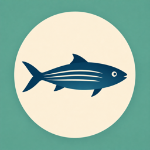
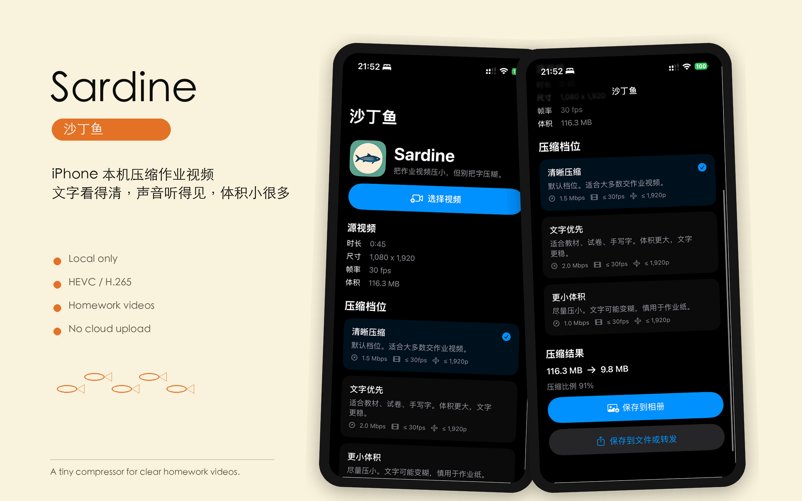

# Sardine





Sardine is a small iOS video compression app for homework-style videos: worksheets, textbooks, notebooks, whiteboards, and short narrated assignments.

The product goal is deliberately narrow:

> Keep text readable and audio clear, while reducing file size enough for everyday sharing.

Sardine is designed for iPhone-only workflows. It does not upload videos to a server, and it does not depend on third-party compression apps.

## Why “Sardine”

Sardines are small, compact, and memorable. The name fits a tool that packs large homework videos into a much smaller file without destroying the important details.

This also keeps the naming style aligned with `Marlin`, the earlier ocean-themed network monitoring project.

## Current status

Sardine now has a working local iOS app flow:

- pick a video from Photos;
- read duration, dimensions, frame rate, and file size;
- choose a compression preset;
- compress locally with AVFoundation;
- keep 1080p-class readability by default;
- save the result back to Photos;
- share or save the compressed MP4 through the system share sheet.

The app icon and brand avatar are bundled through `Assets.xcassets`. There is no server component.

## Build

Open the checked-in Xcode project:

```bash
open Sardine.xcodeproj
```

Then run the `Sardine` scheme on an iPhone simulator or physical iPhone.

Physical device testing is required for real video compression performance and photo library save behavior.

The repository still keeps `project.yml` so future agents can regenerate the project with XcodeGen when needed:

```bash
brew install xcodegen
xcodegen generate
```

## Product defaults

The default preset is:

| Setting | Value |
|---|---|
| Codec | HEVC / H.265 |
| Container | MP4 |
| Resolution | Long side <= 1920 px |
| Frame rate | <= 30 fps |
| Video bitrate | 1.5 Mbps for clear compression |
| Audio | Prefer passthrough; fallback to AAC 96 kbps when needed |

For text-heavy worksheets, textbooks, and handwriting, use the text-first preset at 2.0 Mbps.

Do not default to 720p. Text on worksheets and textbooks degrades too quickly at 720p.

## Documentation

- [Chinese README](README.zh-CN.md)
- [Technical Design](docs/technical-design.md)
- [Compression Presets](docs/compression-presets.md)
- [Brand Guide](docs/brand.md)
- [Distribution Plan](docs/distribution.md)
- [Test Plan](docs/test-plan.md)
- [Agent Handoff](docs/agent-handoff.md)

## Repository layout

```text
sardine-ios
├── Sardine/                 # SwiftUI app source
├── SardineTests/            # Unit tests
├── assets/brand/            # Brand source and exported images
├── docs/                    # Product, technical, testing, and handoff docs
├── project.yml              # XcodeGen spec
├── README.md
├── README.zh-CN.md
├── AGENTS.md
├── LICENSE
└── .gitignore
```

## Privacy posture

Sardine should process videos locally on device. No analytics, server upload, account system, or cloud dependency should be added without explicit product review.

Current app permissions are limited to selecting videos from Photos and saving compressed videos back to Photos.

## License

MIT License. See [LICENSE](LICENSE).
