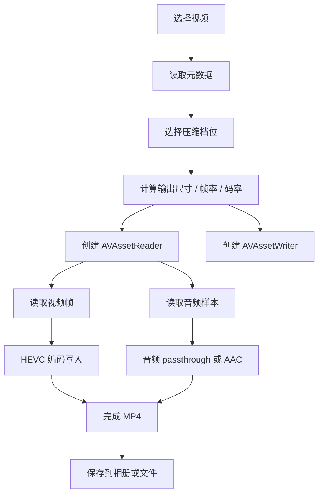

# Sardine iOS 技术方案

项目名：`Sardine`
中文名：沙丁鱼压缩  
目标平台：iPhone 13 Pro、iPhone 14 Pro Max 及同级或更新机型  
文档版本：v0.1  
日期：2026-07-08

## 1. 背景

当前需求不是做一个通用视频剪辑工具，而是解决一个非常具体的问题：

> 手机已经完成拍摄，内容主要是交作业、拍纸面、拍讲解、拍教材。要求文字和声音能看清、听清，同时尽量减少视频体积，并且整个流程在 iPhone 内闭环完成。

已经验证过的 Mac 侧方案是：

- 编码：HEVC / H.265
- 编码器：CPU x265
- 参数：`preset=fast`、`CRF=28`
- 样片：`IMG_9488.MOV`
- 效果：约 54 秒视频压到约 6.5MB，文字清晰度可接受

但 iPhone 不能直接复用 `libx265 CRF` 这一套。iPhone 上可控、稳定、系统级的路径是：

- `AVFoundation`
- `AVAssetReader`
- `AVAssetWriter`
- 系统 HEVC/H.265 硬件编码器
- 通过 `AVVideoAverageBitRateKey` 控制目标码率

核心取舍：

> iPhone 端无法在同等低码率下稳定达到 Mac CPU x265 的细节保留能力。因此 iPhone 端应以“可复现的自定义码率 + 文字优先预设”为主，而不是追求极限小体积。

## 2. 项目目标

### 2.1 必须实现

- 从相册选择视频。
- 支持从“文件”App 选择视频。
- 输出 MP4 文件。
- 使用 HEVC/H.265 压缩视频。
- 提供可调压缩档位：
  - 作业清晰
  - 文字优先
  - 极限小体积
  - 自定义码率
- 保持 1080p，不默认降到 720p。
- 默认把 60fps 降到 30fps。
- 音频优先保持原样；如果无法 passthrough，则转为 AAC 96k 或 128k。
- 显示压缩进度、预计体积、压缩后体积。
- 支持保存到相册。
- 支持保存到“文件”App。
- 全流程本地执行，不上传服务器。

### 2.2 应该实现

- 支持分享入口：相册 → 分享 → Sardine。
- 支持保存最近一次使用的档位。
- 支持压缩前预估输出体积。
- 支持压缩完成后快速预览。
- 支持显示源视频信息：
  - 时长
  - 分辨率
  - 帧率
  - 原文件大小
  - 估算原始码率
- 支持失败原因提示：
  - iCloud 原片未下载
  - 无相册权限
  - 存储空间不足
  - 编码器不支持当前格式
  - HDR / ProRes 特殊处理

### 2.3 暂不实现

- 不做云端压缩。
- 不做账号体系。
- 不做批量队列的复杂调度。
- 不做视频剪辑功能。
- 不做滤镜、美颜、字幕。
- 不追求与 Mac `libx265 CRF` 在同码率下完全一致。
- 不做纯 HTML/PWA 版本作为主方案。

## 3. 为什么选择原生 iOS App

### 3.1 纯快捷指令不合适

快捷指令可以做视频编码，但控制能力偏粗：

- 很难稳定指定 `1.5Mbps`、`2.0Mbps` 这种目标码率。
- 很难完整控制分辨率、帧率、HEVC、音频 passthrough。
- 不适合做多个可复现的压缩档位。
- 不适合后续做质量检测、参数调优、日志记录。

快捷指令适合作为后续入口，不适合作为压缩引擎。

### 3.2 纯 HTML / PWA 不合适

浏览器端的问题更明显：

- iPhone Safari 对视频编码接口的开放程度不适合做严肃压缩工具。
- Web 端难以稳定调用 HEVC 硬件编码。
- `ffmpeg.wasm` 在 iPhone 上会慢、热、耗电，且容易遇到内存限制。
- 大视频文件读写和保存回相册体验差。

HTML 可以做说明页或配置页，不适合作为核心压缩实现。

### 3.3 原生 App 是最稳路径

原生 App 可以直接调用系统媒体框架：

- `AVAssetReader` 读取视频和音频轨道。
- `AVAssetWriter` 写出 MP4。
- `AVVideoCodecType.hevc` 使用 HEVC/H.265。
- `AVVideoAverageBitRateKey` 控制目标码率。
- `PHPhotoLibrary` 保存到相册。
- `PhotosPicker` 或 `PHPickerViewController` 从相册选视频。
- 后续可通过 Share Extension 或 App Intents 接入分享菜单和快捷指令。

Apple 官方资料：

- iPhone 13 Pro 支持 HEVC、H.264、ProRes 录像和播放：<https://support.apple.com/en-us/111871>
- iPhone 14 Pro 支持 HEVC、H.264、ProRes 录像和播放：<https://support.apple.com/en-us/111849>
- Apple 说明 HEVC 相比 H.264 具有更好的压缩效率：<https://support.apple.com/en-us/116944>
- AVFoundation `AVAssetReader`：<https://developer.apple.com/documentation/avfoundation/avassetreader>
- AVFoundation `AVAssetWriter`：<https://developer.apple.com/documentation/avfoundation/avassetwriter>
- AVFoundation `AVVideoAverageBitRateKey`：<https://developer.apple.com/documentation/avfoundation/avvideoaveragebitratekey>
- AVFoundation `AVVideoCodecType.hevc`：<https://developer.apple.com/documentation/avfoundation/avvideocodectype/hevc>
- PhotosUI `PhotosPicker`：<https://developer.apple.com/documentation/photosui/photospicker>
- App Intents：<https://developer.apple.com/documentation/appintents>

## 4. 推荐技术栈

- 语言：Swift
- UI：SwiftUI
- 最低系统：iOS 17.0+
- 开发工具：Xcode
- 媒体框架：
  - AVFoundation
  - PhotosUI
  - Photos
  - UniformTypeIdentifiers
  - VideoToolbox
- 可选扩展：
  - Share Extension
  - App Intents

最低系统定为 iOS 17.0+，主要是为了降低实现复杂度。如果实际设备系统较新，可以直接提高到 iOS 18+ 或当前 Xcode 推荐版本。

## 5. 产品形态

### 5.1 App 名称

- GitHub 仓库名：`sardine-ios`
- App Display Name：`沙丁鱼`
- Bundle Identifier 示例：`com.futeng.sardine`

### 5.2 首页

首页只保留关键动作：

- 选择视频
- 最近一次压缩结果
- 默认压缩档位
- 设置入口

### 5.3 压缩页

选择视频后进入压缩页，展示：

- 视频缩略图
- 原始体积
- 时长
- 分辨率
- 帧率
- 原始估算码率
- 压缩档位
- 预计输出体积
- 开始压缩按钮

### 5.4 结果页

压缩完成后展示：

- 原始体积 → 输出体积
- 压缩比例
- 输出参数
- 预览按钮
- 保存到相册
- 保存到文件
- 分享

## 6. 压缩档位设计

### 6.1 默认档位：作业清晰

适合大多数作业视频。

- 编码：HEVC/H.265
- 容器：MP4
- 分辨率：长边不超过 1920，通常保持 1080p 竖屏或横屏
- 帧率：最高 30fps
- 视频码率：1.5Mbps
- 音频：优先 passthrough；失败则 AAC 96k
- 目标：文字基本清晰，体积明显下降

### 6.2 文字优先

适合教材、试卷、作业纸、PPT、手写内容。

- 编码：HEVC/H.265
- 容器：MP4
- 分辨率：长边不超过 1920
- 帧率：最高 30fps
- 视频码率：2.0Mbps
- 音频：优先 passthrough；失败则 AAC 128k
- 目标：优先保文字边缘和细线

### 6.3 极限小体积

适合画面内容不复杂，或对文字细节要求不高的视频。

- 编码：HEVC/H.265
- 容器：MP4
- 分辨率：长边不超过 1920
- 帧率：最高 30fps
- 视频码率：1.0Mbps
- 音频：AAC 64k 或 96k
- 目标：尽可能小，但可能牺牲文字细节

### 6.4 自定义

高级入口，允许手动设置：

- 视频码率：0.8Mbps–5.0Mbps
- 分辨率：
  - 保持原尺寸
  - 1080p
  - 720p
- 帧率：
  - 保持原帧率
  - 30fps
  - 25fps
- 音频：
  - 保持原音频
  - AAC 64k
  - AAC 96k
  - AAC 128k

## 7. 体积预估

输出体积主要由总码率决定。

粗略公式：

```text
输出体积 MB ≈ (视频码率 Mbps + 音频码率 Mbps) × 时长秒 ÷ 8
```

例如 54 秒视频：

| 档位 | 视频码率 | 音频 | 预计体积 |
|---|---:|---:|---:|
| 极限小体积 | 1.0Mbps | 96kbps | 约 7.4MB |
| 作业清晰 | 1.5Mbps | 96kbps | 约 10.8MB |
| 文字优先 | 2.0Mbps | 128kbps | 约 14.4MB |

注意：

- 这是 iPhone 硬件编码的合理预期。
- Mac CPU x265 可以在更低码率下保留更多文字细节。
- iPhone 本机为了接近 Mac 侧清晰度，通常需要更高码率。

## 8. 架构设计

### 8.1 模块划分

```text
Sardine
├── App
│   ├── SardineApp.swift
│   └── AppState.swift
├── UI
│   ├── HomeView.swift
│   ├── VideoPickerView.swift
│   ├── CompressionSetupView.swift
│   ├── CompressionProgressView.swift
│   ├── CompressionResultView.swift
│   └── SettingsView.swift
├── Domain
│   ├── CompressionPreset.swift
│   ├── VideoMetadata.swift
│   ├── CompressionJob.swift
│   └── CompressionResult.swift
├── Media
│   ├── VideoMetadataReader.swift
│   ├── CompressionEngine.swift
│   ├── AudioStrategy.swift
│   ├── VideoGeometry.swift
│   └── PhotoLibrarySaver.swift
├── Storage
│   ├── TemporaryFileStore.swift
│   ├── AppSettingsStore.swift
│   └── RecentResultStore.swift
├── ShareExtension
│   └── 可选，v1.1 实现
└── Tests
    ├── CompressionPresetTests.swift
    ├── VideoGeometryTests.swift
    └── BitrateEstimationTests.swift
```

### 8.2 核心数据结构

```swift
struct CompressionPreset: Identifiable, Codable {
    let id: String
    let name: String
    let videoBitrate: Int
    let audioBitrate: Int?
    let maxLongSide: Int
    let maxFrameRate: Int
    let codec: VideoCodec
    let audioMode: AudioMode
}

enum VideoCodec: String, Codable {
    case hevc
    case h264
}

enum AudioMode: String, Codable {
    case passthroughPreferred
    case aac64k
    case aac96k
    case aac128k
}

struct VideoMetadata {
    let duration: TimeInterval
    let naturalSize: CGSize
    let displaySize: CGSize
    let frameRate: Double
    let fileSize: Int64
    let estimatedBitrate: Double
    let hasAudio: Bool
    let isHDR: Bool
    let codec: String?
}

struct CompressionJob {
    let sourceURL: URL
    let preset: CompressionPreset
    let outputURL: URL
}

struct CompressionResult {
    let sourceURL: URL
    let outputURL: URL
    let originalSize: Int64
    let compressedSize: Int64
    let duration: TimeInterval
    let preset: CompressionPreset
}
```

## 9. 压缩引擎设计

### 9.1 总体流程



### 9.2 视频读取

使用：

- `AVURLAsset`
- `AVAssetReader`
- `AVAssetReaderVideoCompositionOutput`

不直接用 `AVAssetReaderTrackOutput` 读取原始视频轨道的原因：

- iPhone 视频通常通过 `preferredTransform` 表示方向。
- 如果不处理方向，竖屏视频容易出现旋转错误。
- 需要统一缩放到目标 render size。

推荐做法：

1. 读取视频轨道 `AVAssetTrack`。
2. 根据 `naturalSize` 和 `preferredTransform` 计算显示尺寸。
3. 生成 `AVMutableVideoComposition`：
   - `renderSize` 为输出尺寸
   - `frameDuration` 为目标帧率
   - `AVMutableVideoCompositionLayerInstruction` 应用旋转和缩放
4. 使用 `AVAssetReaderVideoCompositionOutput` 输出 pixel buffer。

### 9.3 视频写入

使用：

- `AVAssetWriter`
- `AVAssetWriterInput`
- 输出文件类型：`.mp4`
- 视频编码：`AVVideoCodecType.hevc`

核心 writer settings：

```swift
let videoSettings: [String: Any] = [
    AVVideoCodecKey: AVVideoCodecType.hevc,
    AVVideoWidthKey: outputWidth,
    AVVideoHeightKey: outputHeight,
    AVVideoCompressionPropertiesKey: [
        AVVideoAverageBitRateKey: preset.videoBitrate,
        AVVideoExpectedSourceFrameRateKey: preset.maxFrameRate,
        AVVideoMaxKeyFrameIntervalKey: preset.maxFrameRate
    ]
]
```

说明：

- `AVVideoAverageBitRateKey` 是最重要的控制项。
- 这里没有 CRF。iOS 硬件编码器主要走目标码率模式。
- 码率低于 1.0Mbps 时，文字视频容易糊。
- 默认不使用 720p，因为纸面文字压到 720p 后边缘损失明显。

### 9.4 帧率处理

默认策略：

- 源视频 ≤ 30fps：保持源帧率。
- 源视频 > 30fps：输出 30fps。

原因：

- 交作业视频不需要 60fps。
- 从 60fps 降到 30fps，通常能显著减少体积。
- 纸面和讲解视频的运动信息价值较低。

### 9.5 音频处理

优先级：

1. 音频 passthrough。
2. 如果 passthrough 失败，转 AAC。

推荐音频参数：

- 默认：AAC 96k
- 文字优先：AAC 128k
- 极限小体积：AAC 64k 或 96k

注意：

- 用户提出“声音维持不变”，因此默认应优先保留原音频。
- 但 MP4 muxing、源音频格式、系统 API 限制可能导致 passthrough 失败。
- App 应自动 fallback，而不是让任务失败。

### 9.6 进度回调

进度计算：

```text
progress = 当前写入视频帧 PTS / 视频总时长
```

UI 每 0.2–0.5 秒刷新一次即可。

### 9.7 后台行为

iOS 不适合长时间后台压缩。

策略：

- 压缩时保持 App 前台。
- 压缩期间关闭自动锁屏：
  - `UIApplication.shared.isIdleTimerDisabled = true`
- 开启 background task 只作为短暂兜底：
  - 用户切后台时尽量完成当前任务
  - 不承诺长视频后台稳定完成

## 10. 权限设计

需要的权限文案：

```xml
<key>NSPhotoLibraryUsageDescription</key>
<string>用于选择需要压缩的作业视频。</string>

<key>NSPhotoLibraryAddUsageDescription</key>
<string>用于把压缩后的视频保存到相册。</string>
```

如果只使用 `PhotosPicker` 选择视频，读取权限压力较小；保存到相册仍需要 add 权限。

## 11. 文件存储策略

### 11.1 临时文件

压缩过程中的输出先写入 App 沙盒临时目录：

```text
tmp/Sardine/{job-id}/output.mp4
```

压缩成功后再执行：

- 保存到相册
- 或导出到 Files
- 或分享

失败时清理临时目录。

### 11.2 命名规则

默认命名：

```text
原文件名-压缩.mp4
原文件名-压缩-2.mp4
原文件名-压缩-3.mp4
```

如果来源是相册，可能拿不到真实文件名，则使用：

```text
Sardine-20260708-112300.mp4
```

## 12. Share Extension 方案

### 12.1 为什么 Share Extension 不直接压缩

分享扩展有运行时长和内存限制，不适合做重压缩。

正确做法：

1. Share Extension 接收视频。
2. 把视频复制到 App Group 临时目录。
3. 写入一个 pending job 标记。
4. 打开主 App。
5. 主 App 读取 pending job 并开始压缩。

### 12.2 v1 与 v1.1 的取舍

v1 先不做 Share Extension，只做主 App 选择视频。

原因：

- 压缩引擎是核心风险。
- Share Extension 只是入口，不应该先复杂化。

v1.1 再加：

- 相册分享入口
- 文件分享入口
- 从分享进入后自动选中默认档位

## 13. App Intents / 快捷指令

后续可以提供一个 App Intent：

```text
Compress Homework Video
输入：视频文件
参数：压缩档位
输出：压缩后视频文件
```

用途：

- 让快捷指令调用 Sardine。
- 用户可以建立自己的自动化流程。
- 例如：从文件选择视频 → 调用 Sardine 压缩 → 保存结果。

但 App Intent 不应替代主 App UI。主 App 仍然是最可靠入口。

## 14. 质量策略

### 14.1 文字视频的关键问题

纸面文字、教材、试卷、PPT 的压缩难点是：

- 细线很多
- 大面积浅色背景
- 手持拍摄有轻微运动模糊
- 自动曝光和降噪会让背景变化
- 低码率硬件编码容易把文字边缘抹平

因此策略是：

- 不默认降到 720p。
- 不默认低于 1.5Mbps。
- 默认把 60fps 降到 30fps。
- 用 1080p 保留文字空间分辨率。
- 用码率保障文字边缘。

### 14.2 推荐参数

| 场景 | 分辨率 | 帧率 | 视频码率 | 音频 | 预期 |
|---|---:|---:|---:|---:|---|
| 作业清晰 | 1080p | 30fps | 1.5Mbps | 原音频 / AAC 96k | 默认 |
| 文字优先 | 1080p | 30fps | 2.0Mbps | 原音频 / AAC 128k | 字更稳 |
| 极限小体积 | 1080p | 30fps | 1.0Mbps | AAC 64k/96k | 可能糊 |
| 兼容优先 | 1080p | 30fps | 2.0Mbps | AAC 128k | H.264，可选 |

### 14.3 自动推荐档位

可以根据源视频特征给建议：

- 如果源视频 > 50fps：提示“将降到 30fps，体积会明显下降”。
- 如果源视频为 4K：提示“将降到 1080p，适合交作业”。
- 如果视频码率已经低于 2Mbps：提示“源视频已经很小，继续压缩可能明显变糊”。
- 如果检测到 HDR：提示“将转为标准动态范围，可能改变颜色”或保留 HDR 作为高级选项。

## 15. 测试计划

### 15.1 样片

至少准备以下样片：

1. 纸面英文教材，竖屏，1080p60。
2. 纸面中文手写，竖屏，1080p30。
3. PPT 或电脑屏幕，横屏，1080p30。
4. 普通讲解视频，有人声，1080p30。
5. 4K60 源视频。
6. HDR 视频。
7. ProRes 视频。

### 15.2 指标

每个样片记录：

- 原始大小
- 输出大小
- 压缩耗时
- 输出分辨率
- 输出帧率
- 输出视频码率
- 输出音频码率
- 是否可保存相册
- 是否可播放
- 是否音画同步
- 主观文字清晰度

### 15.3 验收标准

默认“作业清晰”档：

- 1080p 源视频不降到 720p。
- 60fps 源视频输出 30fps。
- 文字在手机上全屏查看基本可读。
- 声音清楚，音画同步。
- 输出体积明显低于原视频。
- 1 分钟视频目标体积约 10–13MB。

“文字优先”档：

- 文字清晰度优于默认档。
- 1 分钟视频目标体积约 14–17MB。

“极限小体积”档：

- 1 分钟视频目标体积约 7–9MB。
- 明确提示可能牺牲文字清晰度。

## 16. 开发里程碑

### M0：项目初始化

产出：

- Xcode 项目
- SwiftUI 空 App
- 基础目录结构
- GitHub README
- 权限配置

预计：0.5 天

### M1：视频选择与元数据读取

产出：

- 相册选择视频
- 文件选择视频
- 读取时长、体积、分辨率、帧率
- 展示源视频信息

预计：1 天

### M2：压缩引擎原型

产出：

- AVAssetReader + AVAssetWriter 打通
- HEVC 输出 MP4
- 固定 1080p / 30fps / 1.5Mbps
- 进度显示

预计：2–3 天

### M3：压缩档位与保存

产出：

- 三个默认档位
- 自定义码率
- 保存到相册
- 保存到文件
- 结果页

预计：1–2 天

### M4：质量调优

产出：

- 用真实作业视频测试
- 调整默认码率
- 处理竖屏/横屏方向
- 处理 4K、60fps、HDR、ProRes

预计：2–3 天

### M5：分享入口

产出：

- Share Extension
- 从相册分享到 Sardine
- 从 Files 分享到 Sardine

预计：1–2 天

### M6：快捷指令入口

产出：

- App Intent
- 可被 Shortcuts 调用
- 支持选择档位

预计：1–2 天

## 17. 技术风险

### 17.1 同码率画质不如 Mac x265

风险：

- iPhone 硬件 HEVC 在低码率下保文字能力不如 Mac CPU x265。

应对：

- 默认码率不低于 1.5Mbps。
- 提供 2.0Mbps 文字优先档。
- 极限小体积明确提示风险。

### 17.2 HDR / Dolby Vision 处理复杂

风险：

- HDR 视频转 SDR 可能变色。
- 保留 HDR 会增加兼容复杂度。

应对：

- v1 先转普通 SDR 或提示用户。
- v2 再研究 HDR 保留。

### 17.3 音频 passthrough 不一定总成功

风险：

- 源音频格式或容器兼容性导致 passthrough 失败。

应对：

- 优先 passthrough。
- 失败自动 AAC。
- UI 明确显示最终音频策略。

### 17.4 后台压缩不稳定

风险：

- 用户切后台后，iOS 可能中止任务。

应对：

- 压缩时提示保持 App 打开。
- 关闭自动锁屏。
- 使用 background task 作为短时间兜底。

### 17.5 iCloud 原片未下载

风险：

- 用户在相册看到视频，但原片在 iCloud，读取时需要下载。

应对：

- 选择视频后先复制到本地临时目录。
- 显示“正在准备视频”。
- 下载失败时给出明确提示。

## 18. GitHub 仓库建议

仓库名：

```text
sardine-ios
```

建议初始文件：

```text
sardine-ios
├── README.md
├── docs
│   ├── technical-design.md
│   ├── compression-presets.md
│   └── test-plan.md
├── Sardine
│   └── Xcode project files
└── LICENSE
```

README 首屏建议：

```markdown
# Sardine

沙丁鱼压缩：一个自用 iOS 视频压缩工具，专门面向交作业、拍纸面、拍教材、拍讲解场景。

目标是在 iPhone 本机完成 HEVC 压缩，保持文字基本清晰、声音可听，同时显著减少视频体积。
```

## 19. 后续执行建议

第一阶段不要急着做分享扩展和快捷指令。

推荐顺序：

1. 先做主 App。
2. 打通单视频压缩。
3. 用真实作业视频调参数。
4. 确认默认档位。
5. 再做分享入口。
6. 最后做快捷指令入口。

这样可以避免入口很多，但压缩质量不稳定。

## 20. 当前推荐默认参数

v1 默认使用：

```text
编码：HEVC / H.265
容器：MP4
分辨率：长边不超过 1920
帧率：最高 30fps
视频码率：1.5Mbps
音频：优先保留原音频，失败则 AAC 96k
```

如果测试发现文字仍然糊，默认码率提升到：

```text
视频码率：2.0Mbps
音频：优先保留原音频，失败则 AAC 128k
```

判断标准很简单：

> 作业视频不是电影，优先级是文字可读和声音清楚；体积小是第三优先级。
